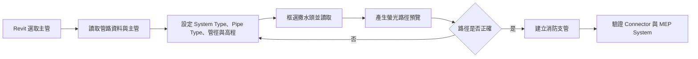
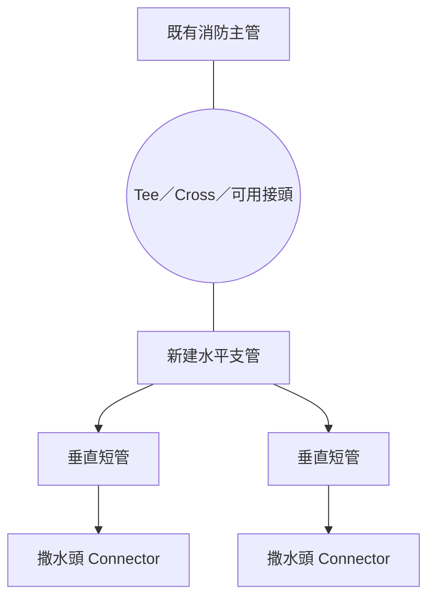

# SC REVIT

SC REVIT 是一套 Revit 2024 MEP 輔助工具集，目前以安裝包形式提供測試使用。  
目前請使用 GitHub Releases 下載安裝包，不要使用 GitHub 的 `Code > Download ZIP`。

目前版本為 `v0.5.3`，整合點位放置、消防支管、預覽生命週期、CAD 路徑核對及部署穩定性修正。

## 快速下載

| 項目 | 連結 |
| --- | --- |
| Windows 一鍵安裝／更新包 | [下載 `SC_REVIT_v0.5.3_installer.zip`](https://github.com/NicheSam/SC-REVIT/releases/download/v0.5.3/SC_REVIT_v0.5.3_installer.zip) |
| SHA-256 校驗檔 | [下載 `SC_REVIT_v0.5.3_installer.zip.sha256`](https://github.com/NicheSam/SC-REVIT/releases/download/v0.5.3/SC_REVIT_v0.5.3_installer.zip.sha256) |
| 版本說明 | [GitHub Release：v0.5.3](https://github.com/NicheSam/SC-REVIT/releases/tag/v0.5.3) |
| 排水操作手冊 | [Markdown](docs/SC_REVIT_drainage_operation_manual.md) · [PDF](docs/SC_REVIT_drainage_operation_manual.pdf) |

> 請完整解壓縮下載的 installer ZIP，再執行裡面的 `Install_SC_REVIT.bat`。GitHub 自動提供的 `Source code (zip)` 與 `Source code (tar.gz)` 不是安裝包。

## v0.5.3 版本狀態

目前公開基準包含 Revit 2024 排水接入幹管工作流程，以及經實機驗證的消防支管建立與系統類型統一流程：

- 以開放 piping connector 作為支管來源。
- 依序選取支管與目標主管。
- 立管使用來源側雙 45°、徑向管段及平面 45° 接入。
- 支援不同管徑與專案管件設定。
- 建立後檢查管件角度、接入方向、管段長度與拓撲。

本版同時修正 CAD 點位與消防支管預覽殘留、異常座標、螢光路徑顯示及消防管網連接／系統類型問題。Agent listener 預設停用，Revit Ribbon 人工功能仍可正常使用；只在需要 Agent 功能時才手動啟用監聽。

## 功能狀態

| 功能 | 狀態 | 說明 |
| --- | --- | --- |
| 批量點位放置 | 可用 | 從 CAD／DWG 點位建立 Revit 元件，含座標對位與暫存預覽清理。 |
| 消防支管建立 | 可用 | 由主管、支管設定與撒水頭位置建立管網，完成後驗證 Connector 與系統類型。 |
| 排水接入幹管／管件設定／管中心對齊 | 可用 | 依專案 Pipe Type、System Type 與管件設定建立排水接管。 |
| SC 後台 | 可用 | 查看操作紀錄、建立結果與診斷資訊。 |
| 族群歸檔／專案回收 | **開發中** | 尚未列為穩定通用流程。 |
| 開孔定位 | **開發中** | 尚未列為穩定通用流程。 |
| 身份檢查／參數健檢／斷點檢查 | **開發中** | 檢查與修復範圍仍在調整。 |
| 管支撐預覽 | **開發中** | 預覽與建立流程仍在調整。 |

Ribbon 上的開發中功能也會直接顯示「開發中」，使用前請先在副本或小範圍模型驗證。

## 消防支管操作教學

### 操作流程

1. 在 Revit 選取一支消防主管，開啟 `消防支管建立`。
2. 按 `讀取管路資料`，載入專案中的系統類型、管類型、樓層與已使用管徑。
3. 按 `讀取選取主管`，確認畫面顯示的主管 Element ID 正確。
4. 設定支管的 `系統類型`、`管類型`、`管徑`、`樓層`、`支管距離樓層高度(cm)` 與高度基準。這組支管設定會套用到新建支管及其連接的撒水頭；不會用既有主管的系統類型覆蓋支管設定。
5. 回到 Revit 框選或多選要接管的撒水頭，再按 `讀取框選撒水頭`。確認清單中的 ID、族群、類型與座標。
6. 按 `產生螢光路徑預覽`，檢查支管方向、分排與接管位置。若模型中有可見 CAD，系統會在背景核對撒水頭附近的 CAD 路徑；這是輔助核對，不會取代拓撲演算法。
7. 路徑正確後按 `建立消防支管`，在確認視窗核對主管、撒水頭數量及 CAD 影子核對狀態，再執行建立。
8. 建立完成後，工具會驗證新管段、管件、撒水頭 Connector 與 MEP System。任一批次驗證失敗時，該批次會回復，不留下半完成管網。

### 拓撲示意

同排撒水頭共用一支水平支管；支管再經垂直短管接到每顆撒水頭。主管交會處會依實際拓撲與管徑選擇可用的接頭，不以單一接頭方式套用所有情況。

目前版本不做障礙物繞行與自動變徑。螢光線只是暫存預覽；重新預覽、完成建立、取消流程或關閉工具視窗時，系統會在背景清除 SC REVIT 建立的預覽元素與未使用群組類型。

## 排水操作手冊

目前手冊已依 `main` 的實際 Ribbon 與命令流程更新：

- [GitHub 可直接閱讀的 Markdown 完整手冊](docs/SC_REVIT_drainage_operation_manual.md)
- [下載／列印 PDF 手冊](docs/SC_REVIT_drainage_operation_manual.pdf)
- [HTML 圖文版](docs/SC_REVIT_v0.5.0_drainage_user_guide.html)（下載後以瀏覽器開啟）

目前排水面板對使用者開放三項操作：

### 排水 Ribbon 快速對照

| 圖示 | 按鈕 | 用途 |
| --- | --- | --- |
|  | 排水接入幹管 | 依提示先選來源，再選這一支要接入的主管；成功後可繼續下一支。 |
|  | 管件設定 | 依目標 Pipe Type／System Type 設定斜 T／Y、彎頭、變徑、坡度與管徑範圍。 |
|  | 管中心對齊 | 先選非垂直的高程基準管，再連續對齊其他管段的局部中心線高程。 |

`45度對接`、`向下45°` 與 `垂直向下` 目前不在 Ribbon 上，不應再依舊手冊尋找這三個按鈕。

### 最短操作流程

1. 展開 `排水接入幹管`，先進入 `管件設定`。
2. 選擇目標 Pipe Type 與 System Type，新增設定列並確認管件、管徑及坡度後儲存。
3. 執行 `排水接入幹管`。
4. 依 `1/2` 提示點選設備接口或開放管端。
5. 依 `2/2` 提示明確點選本支要接入的主管。
6. 成功後直接繼續下一支；單支失敗會回復該支並顯示處理方式。
7. 按 `Esc` 結束整輪操作；成功結果合併為一次 Revit Undo。

## 安裝與更新

需求：Windows 10／11、Autodesk Revit 2024。使用者不需要安裝 Python、Visual Studio 或自行編譯。

1. 從上方「快速下載」取得 installer ZIP，並完整解壓縮。
2. 關閉 Revit 2024 與所有 SC REVIT 視窗。
3. 執行 `Install_SC_REVIT.bat`。
4. 安裝完成後重新開啟 Revit，在 Ribbon 找到 `SC 族群工具`。

同一個安裝檔同時支援首次安裝與覆蓋更新，不需先移除舊版。第一次載入若 Revit 顯示未簽章警告，確認名稱為 `SC REVIT` 與下載來源正確後再允許載入。一般 Ribbon 操作不需要啟用 Agent。

## 基本使用方式

安裝完成並重新啟動 Revit 後，開啟 `SC 族群工具` Ribbon。  
目前主要工具包含：

- `族群歸檔`（**開發中**）：整理與歸檔 Revit 族群。
- `專案回收`（**開發中**）：掃描專案內族群，準備回收整理。
- `批量點位放置`：從 CAD / DWG block 點位批量放置 Revit 元件。
- `SC 後台`：查看工具操作紀錄、建立結果與後續管理狀態。
- `開孔定位`（**開發中**）：檢查 MEP 與建築連結物件，產生開孔候選。
- `消防支管建立`：依候選主管與撒水頭位置，輔助建立垂直於最近主管的消防支管。
- `身份檢查`（**開發中**）：檢查選取元件是否具備後台追蹤所需身份資料。
- `參數健檢`（**開發中**）：檢查 SC_ 參數缺漏與空值。
- `斷點檢查`（**開發中**）：診斷 pipe / duct / conduit 連接狀態，只對可修復 pipe 執行自動修復。
- `管支撐預覽`（**開發中**）：依選取 pipe 產生支撐候選點預覽。
- `排水接入幹管`：依序選取開放支管端與目標主管，建立符合專案設定的排水接管。
- `管件設定`：依 Pipe Type 設定斜 T／Y、45°彎頭、變徑及排水坡度。

## 常見問題

### 看不到 Ribbon

- 確認已重新啟動 Revit。
- 重新執行 `Install_SC_REVIT.bat`。
- 確認目前使用的是 Revit 2024。

### Revit 卡頓、無回應或需要回報問題

1. 先執行 `Disable_SC_REVIT_Agent.bat`，確認人工 Ribbon 功能是否恢復正常。
2. 關閉 Revit 後重新測試。
3. 執行 `Collect_SC_REVIT_Diagnostics.bat`，將桌面產生的診斷 ZIP 交給開發者。

`v0.5.3` 的 Agent listener 預設停用；停用 Agent 不會移除或停用 Revit Ribbon 人工功能。

### 點工具後沒有資料

部分工具依賴目前 Revit 模型狀態。  
例如 CAD 點位需要模型中有 CAD Link / DWG，管線檢查需要先選取 pipe / duct / conduit。

## 給開發者

這個 public repo 同時保存可下載安裝版的版本說明，以及目前公開的開發原始碼。  
`v0.5.3` 已完成目前專案中的消防支管實機建立驗證；不同專案的族群 Connector、管件與系統設定仍可能不同，正式批次使用前應先做小範圍測試。

開發者打包新版 installer 時，請使用專案內的 release 打包腳本產生 installer ZIP，再上傳到 GitHub Releases。
